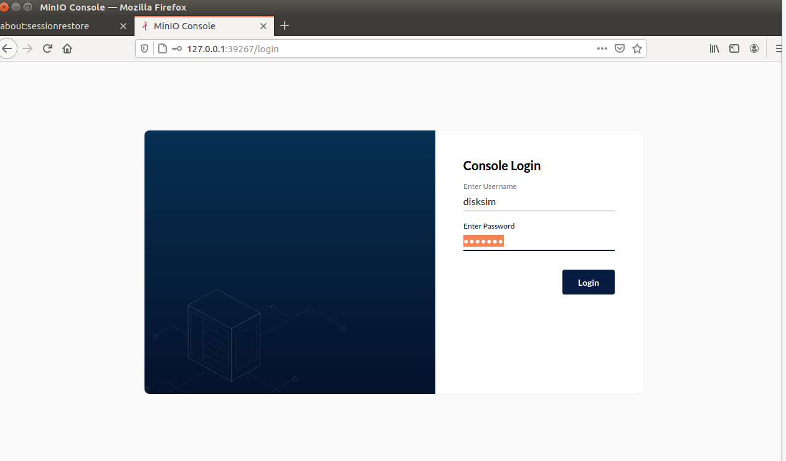
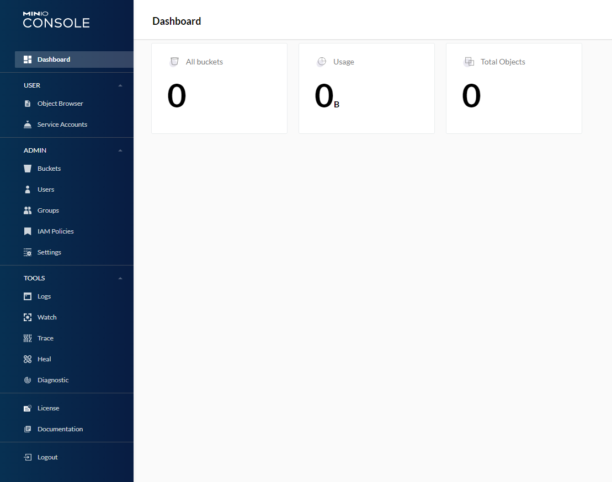
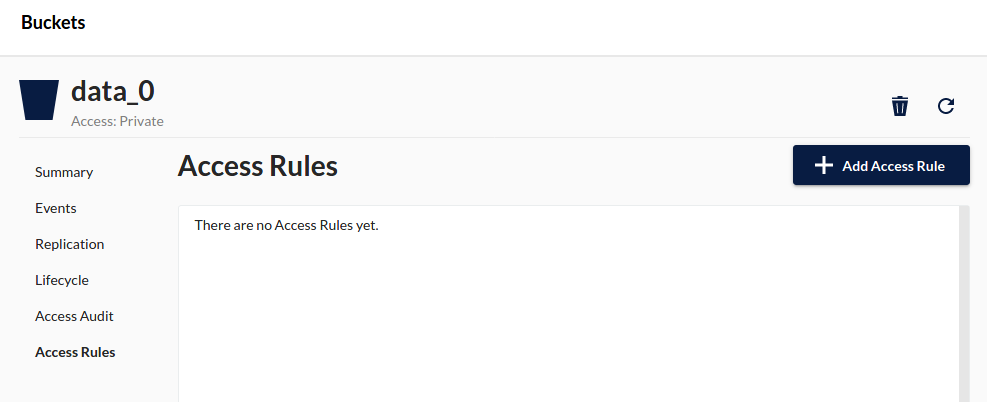
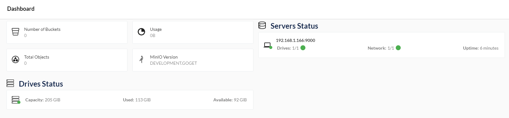
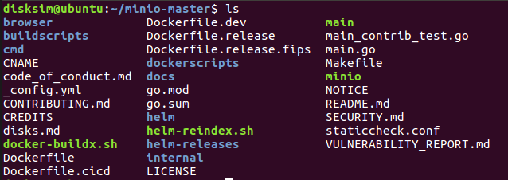
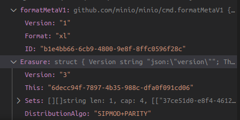
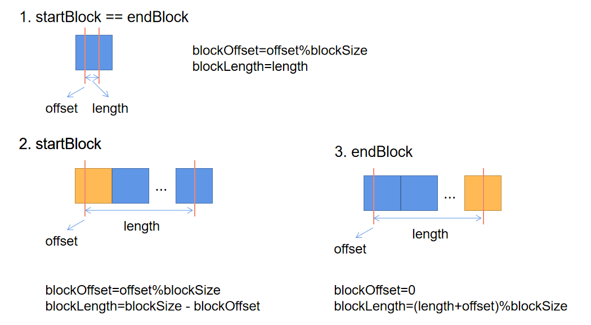

# Part i Have a bite at Minio

Docker[**warning: all data will be lost after closing docker container**] . We introduce briefly. 

```
podman run \
  -p 9000:9000 \
  -p 9001:9001 \
  minio/minio server /data --console-address ":9001"
```

  -d, --detach               Run container in background and
                                       print container ID

-v set the enviroment variable.

For example, I want to set the credential

```
docker run   -p 9000:9000   -p 9001:9001  -e "MINIO_ROOT_USER=minio" -e "MINIO_ROOT_PASSWORD=minio123456" minio/minio server ./data --console-address ":9001" 
```


## Hack on MinIO

Why I choose MinIO to further my research?

1. MinIO is written in GO. It has comparable operation speed as C. Also, it supports some advanced features like slicing and native concurrency.  This makes it the perfect language in distributed storage system development.
2. MinIO supports erasure codes.  We could easily modify the source code for our purpose. MinIo supports stanalone machines with enormous drives.
3. Compared to Hadoop3.0, MinIo is a light-weighted architecture. It is based on Object Store and compatible with Amazon S3. 

## What is Bit Rot protection?

Bit Rot, also known as data rot or silent data corruption is a data loss issue faced by disk drives today. Data on the drive may silently get corrupted without signaling an error has occurred, making bit rot more dangerous than a permanent hard drive failure.

MinIO's erasure coded backend uses high speed [HighwayHash](https://github.com/minio/highwayhash) checksums to protect against Bit Rot.

## How are drives used for Erasure Code?

MinIO divides the drives you provide into erasure-coding sets of *4 to 16* drives. Therefore, the number of drives you present must be a multiple of one of these numbers. Each object is written to a single erasure-coding set.

Minio uses the largest possible EC set size which divides into the number of drives given. For example, *18 drives* are configured as *2 sets of 9 drives*, and *24 drives* are configured as *2 sets of 12 drives*. This is true for scenarios when running MinIO as a standalone erasure coded deployment. In [distributed setup however node (affinity) based](https://docs.minio.io/docs/distributed-minio-quickstart-guide.html) erasure stripe sizes are chosen.

The drives should all be of approximately the same size.

## Get Started with MinIO in Erasure Code

### 1. Prerequisites

Install MinIO - [MinIO Quickstart Guide](https://docs.min.io/docs/minio-quickstart-guide)

### 2. Run MinIO Server with Erasure Code

Example: Start MinIO server in a 12 drives setup, using MinIO binary. (File folder also makes sense for tests)

```
minio server /data{1..
```

Example: Start MinIO server in a 8 drives setup, using MinIO Docker image.

```
podman run \
  -p 9000:9000 \
  -p 9001:9001 \
  --name minio \
  -v /mnt/data1:/data1 \
  -v /mnt/data2:/data2 \
  -v /mnt/data3:/data3 \
  -v /mnt/data4:/data4 \
  -v /mnt/data5:/data5 \
  -v /mnt/data6:/data6 \
  -v /mnt/data7:/data7 \
  -v /mnt/data8:/data8 \
  minio/minio server /data{1...8} --console-address ":9001"
```

### 3. Test your setup

You may unplug drives randomly and continue to perform I/O on the system.

服务器对磁盘数目要求： 必须是偶数，大于等于小于16。




默认账户密码为 minioadmin: minioadmin



进去之后是非常炫酷的UI界面。可以创建桶等。每个桶都有自己的policy。



Useful Examples

```
NAME:
  minio server - start object storage server

USAGE:
  minio server [FLAGS] DIR1 [DIR2..]
  minio server [FLAGS] DIR{1...64}
  minio server [FLAGS] DIR{1...64} DIR{65...128}

DIR:
  DIR points to a directory on a filesystem. When you want to combine
  multiple drives into a single large system, pass one directory per
  filesystem separated by space. You may also use a '...' convention
  to abbreviate the directory arguments. Remote directories in a
  distributed setup are encoded as HTTP(s) URIs.

FLAGS:
  --address value              bind to a specific ADDRESS:PORT, ADDRESS can be an IP or hostname (default: ":9000")
  --console-address value      bind to a specific ADDRESS:PORT for embedded Console UI, ADDRESS can be an IP or hostname
  --certs-dir value, -S value  path to certs directory (default: "/root/.minio/certs")
  --quiet                      disable startup information
  --anonymous                  hide sensitive information from logging
  --json                       output server logs and startup information in json format
  --help, -h                   show help
  
EXAMPLES:
  1. Start minio server on "/home/shared" directory.
     $ minio server /home/shared

  2. Start single node server with 64 local drives "/mnt/data1" to "/mnt/data64".
     $ minio server /mnt/data{1...64}

  3. Start distributed minio server on an 32 node setup with 32 drives each, run following command on all the nodes
     $ export MINIO_ROOT_USER=minio
     $ export MINIO_ROOT_PASSWORD=miniostorage
     $ minio server http://node{1...32}.example.com/mnt/export{1...32}

  4. Start distributed minio server in an expanded setup, run the following command on all the nodes
     $ export MINIO_ROOT_USER=minio
     $ export MINIO_ROOT_PASSWORD=miniostorage
     $ minio server http://node{1...16}.example.com/mnt/export{1...32} \
            http://node{17...64}.example.com/mnt/export{1...64}

```


## Get Started with Storage Class

The default value for the `STANDARD` storage class depends on the number of volumes in the erasure set:

| Erasure Set Size | Default Parity (EC:N) |
| ---------------- | --------------------- |
| 5 or fewer       | EC:2                  |
| 6-7              | EC:3                  |
| 8 or more        | EC:4                  |

The format to set storage class environment variables is as follows

```
MINIO_STORAGE_CLASS_STANDARD=EC:parity` `MINIO_STORAGE_CLASS_RRS=EC:parity
```

For example, set `MINIO_STORAGE_CLASS_RRS` parity 2 and `MINIO_STORAGE_CLASS_STANDARD` parity 3

```
    export MINIO_STORAGE_CLASS_STANDARD=EC:3
    export MINIO_STORAGE_CLASS_RRS=EC:2
```

Storage class can also be set via `mc admin config` get/set commands to update the configuration. Refer [storage class](https://github.com/minio/minio/tree/master/docs/config#storage-class) for more details.


## Minio Client

- [
  MINIO GATEWAY](https://docs.min.io/docs/minio-client-quickstart-guide.html)
- [MINIO DEPLOYMENT](https://docs.min.io/docs/minio-client-quickstart-guide.html)
- MINIO CLIENT
  - [MinIO Client Quickstart Guide](https://docs.min.io/docs/minio-client-quickstart-guide.html)
  - [MinIO Client Complete Guide](https://docs.min.io/docs/minio-client-complete-guide.html)
  - [MinIO Admin Complete Guide](https://docs.min.io/docs/minio-admin-complete-guide.html)
- [MINIO SDKS](https://docs.min.io/docs/minio-client-quickstart-guide.html)
- [COOKBOOK](https://docs.min.io/docs/minio-client-quickstart-guide.html)


[ Suggest an Edit](https://docs.min.io/docs/minio-client-quickstart-guide.html)

# MinIO Client Quickstart Guide

[](https://slack.min.io/) [](https://goreportcard.com/report/minio/mc) [](https://hub.docker.com/r/minio/mc/) [](https://github.com/minio/mc/blob/master/LICENSE)

MinIO Client (mc) provides a modern alternative to UNIX commands like ls, cat, cp, mirror, diff, find etc. It supports filesystems and Amazon S3 compatible cloud storage service (AWS Signature v2 and v4).

```
Copyalias       set, remove and list aliases in configuration file
ls          list buckets and objects
mb          make a bucket
rb          remove a bucket
cp          copy objects
mirror      synchronize object(s) to a remote site
cat         display object contents
head        display first 'n' lines of an object
pipe        stream STDIN to an object
share       generate URL for temporary access to an object
find        search for objects
sql         run sql queries on objects
stat        show object metadata
mv          move objects
tree        list buckets and objects in a tree format
du          summarize disk usage recursively
retention   set retention for object(s)
legalhold   set legal hold for object(s)
diff        list differences in object name, size, and date between two buckets
rm          remove objects
encrypt    manage bucket encryption config
event       manage object notifications
watch       listen for object notification events
undo        undo PUT/DELETE operations
policy      manage anonymous access to buckets and objects
tag         manage tags for bucket(s) and object(s)
ilm         manage bucket lifecycle
version     manage bucket versioning
replicate   configure server side bucket replication
admin       manage MinIO servers
update      update mc to latest release
```

把minio服务器作为客户端默认服务器

```
mc alias set myminio http://192.168.58.147:9000 minioadmin minioadmin
```




界面都霸气了不少！

```
/dev/sda   /dev/sdaf   /dev/sdak   /dev/sdan5  /dev/sdg  /dev/sdm  /dev/sds  /dev/sdy
/dev/sdaa  /dev/sdag   /dev/sdal   /dev/sdb    /dev/sdh  /dev/sdn  /dev/sdt  /dev/sdz
/dev/sdab  /dev/sdah   /dev/sdam   /dev/sdc    /dev/sdi  /dev/sdo  /dev/sdu
/dev/sdac  /dev/sdah1  /dev/sdan   /dev/sdd    /dev/sdj  /dev/sdp  /dev/sdv
/dev/sdad  /dev/sdai   /dev/sdan1  /dev/sde    /dev/sdk  /dev/sdq  /dev/sdw
/dev/sdae  /dev/sdaj   /dev/sdan2  /dev/sdf    /dev/sdl  /dev/sdr  /dev/sdx

a b c d e f g h i j k l m n o p q r s t u v w x y z aa ab ac ad ae af ag ah ai aj ak al am an 
totally 40 hdds
```


插曲

不小心删掉了/etc/fstab

1. yong fdisk -l 看 /, /boot, swap分别挂在哪个盘
2. 用 blkid <dev>看UUID和文件系统类型，可以用PARTUUID来代替UUID
3. 不清楚文件系统类型不要瞎填，可以用 file -sL <dev>来看，填完之后看一下是不是变绿，如果没有，表示系统没有识别。 
4. / 目录下的pass一定是1. 可以用 man fstab查看支持。

参考：https://blog.csdn.net/u010632165/article/details/89597522


```
# /etc/fstab: static file system information.
#
# Use 'blkid' to print the universally unique identifier for a
# device; this may be used with UUID= as a more robust way to name devices
# that works even if disks are added and removed. See fstab(5).
#
# <file system> <mount point>   <type>  <options>       <dump>  <pass>
# / was on /dev/sdan1 during installation
UUID=769a6ec2-009d-4978-bd3e-43e7e4252932	/	ext4	defaults	1	1
# /boot
UUID=042b49a9-02	/boot	msdos	defaults	1	2	
# swap was on /dev/sdan5 during installiation
UUID=bec79d9c-18b1-455f-a3ac-0ef0ed8997d9 swap            swap    defaults	0	0
```


模拟磁盘损坏

坏5个块的时候，下载失败，

```
API: SYSTEM()
Time: 16:22:31 CST 09/23/2021
DeploymentID: 0dcf22eb-e192-4d0d-b551-ac4abdeb9f16
Error: Error(file not found) reading erasure shards at (/home/hds/data/sdi: test1/ceph_15.2.5.orig.tar.gz/a05c9e01-bfc7-42c2-9200-33ea5e6de883/part.1), will attempt to reconstruct if we have quorum (*fmt.wrapError)
       2: /home/hds/go/pkg/mod/github.com/minio/minio@v0.0.0-20210918203135-c4373ef29034/cmd/bitrot-streaming.go:156:cmd.(*streamingBitrotReader).ReadAt()
       1: /home/hds/go/pkg/mod/github.com/minio/minio@v0.0.0-20210918203135-c4373ef29034/cmd/erasure-decode.go:165:cmd.(*parallelReader).Read.func1()
2021/09/23 16:22:32 Resource requested is unreadable, please reduce your request rate

```


# PART ii *Go* Design Philosophy——Insight into Sourcecode

**指针：** Go语言提供了指针。指针是一种直接存储了变量的内存地址的数据类型。在其它语言中，比如C语言，指针操作是完全不受约束的。在另外一些语言中，指针一般被处理为“引用”，除了到处传递这些指针之外，并不能对这些指针做太多事情。Go语言在这两种范围中取了一种平衡。指针是可见的内存地址，&操作符可以返回一个变量的内存地址，并且*操作符可以获取指针指向的变量内容，但是在Go语言里没有指针运算，也就是不能像c语言里可以对指针进行加或减操作。




minio-master文件夹下，有很多文件。


cmd下有大量文件

```
acl-handlers.go                              healthcheck-handler.go
admin-bucket-handlers.go                     healthcheck-router.go
admin-handlers-config-kv.go                  healthinfo.go
admin-handlers.go                            httprange.go
admin-handlers_test.go                       httprange_test.go
admin-handlers-users.go                      http-stats.go
admin-handler-utils.go                       http-tracer.go
admin-heal-ops.go                            http-tracer_test.go
admin-router.go                              iam-dummy-store.go
admin-server-info.go                         iam-etcd-store.go
api-datatypes.go                             iam-etcd-store_test.go
apierrorcode_string.go                       iam.go
api-errors.go                                iam-object-store.go
api-errors_test.go                           jwt.go
api-headers.go                               jwt_test.go
api-headers_test.go                          leak-detect_test.go
api-resources.go                             listen-notification-handlers.go
api-resources_test.go                        local-locker.go
api-response.go                              lock-rest-client.go
api-response_test.go                         lock-rest-client_test.go
api-router.go                                lock-rest-server-common.go
api-utils.go                                 lock-rest-server-common_test.go
api-utils_test.go                            lock-rest-server.go
auth-handler.go                              main.go
auth-handler_test.go                         metacache-bucket_gen.go
background-heal-ops.go                       metacache-bucket_gen_test.go
background-newdisks-heal-ops_gen.go          metacache-bucket.go
background-newdisks-heal-ops_gen_test.go     metacache-bucket_test.go
background-newdisks-heal-ops.go              metacache-entries.go
benchmark-utils_test.go                      metacache-entries_test.go
bitrot.go                                    metacache_gen.go
bitrot-streaming.go                          metacache_gen_test.go
bitrot_test.go                               metacache.go
bitrot-whole.go                              metacache-manager.go
bootstrap-peer-server.go                     metacache-marker.go
bucket-encryption.go                         metacache-server-pool.go
bucket-encryption-handlers.go                metacache-set.go
bucket-encryption_test.go                    metacache-stream.go
bucket-handlers.go                           metacache-stream_test.go
bucket-handlers_test.go                      metacache_test.go
bucket-lifecycle.go                          metacache-walk.go
bucket-lifecycle-handlers.go                 metrics.go
bucket-lifecycle-handlers_test.go            metrics-router.go
bucket-lifecycle_test.go                     metrics-v2.go
bucket-listobjects-handlers.go               mrf.go
bucket-metadata_gen.go                       namespace-lock.go
bucket-metadata_gen_test.go                  namespace-lock_test.go
bucket-metadata.go                           naughty-disk_test.go
bucket-metadata-sys.go                       net.go
bucket-notification-handlers.go              net_test.go
bucket-object-lock.go                        notification.go
bucket-policy.go                             notification-summary.go
bucket-policy-handlers.go                    object-api-common.go
bucket-policy-handlers_test.go               object-api-datatypes.go
bucket-quota.go                              object-api-deleteobject_test.go
bucket-replication.go                        object-api-errors.go
bucket-replication-stats.go                  object-api-getobjectinfo_test.go
bucket-replication_test.go                   object-api-input-checks.go
bucket-stats_gen.go                          object-api-interface.go
bucket-stats_gen_test.go                     object-api-listobjects_test.go
bucket-stats.go                              object-api-multipart_test.go
bucket-targets.go                            object-api-options.go
bucket-versioning.go                         object-api-putobject_test.go
bucket-versioning-handler.go                 object_api_suite_test.go
build-constants.go                           object-api-utils.go
common-main.go                               object-api-utils_test.go
config-common.go                             object-handlers-common.go
config-current.go                            object-handlers-common_test.go
config-current_test.go                       object-handlers.go
config-dir.go                                object-handlers_test.go
config-encrypted.go                          os-dirent_fileino.go
config-encrypted_test.go                     os-dirent_ino.go
config.go                                    os-dirent_namelen_bsd.go
config-migrate.go                            os-dirent_namelen_linux.go
config-migrate_test.go                       os-instrumented.go
config-versions.go                           osmetric_string.go
consolelogger.go                             os-readdir-common.go
copy-part-range.go                           os-readdir_other.go
copy-part-range_test.go                      os-readdir_test.go
crossdomain-xml-handler.go                   os-readdir_unix.go
crossdomain-xml-handler_test.go              os-readdir_windows.go
data-scanner.go                              os-reliable.go
data-update-tracker.go                       os-reliable_test.go
data-update-tracker_test.go                  peer-rest-client.go
data-usage-cache_gen.go                      peer-rest-common.go
data-usage-cache_gen_test.go                 peer-rest-server.go
data-usage-cache.go                          policy_test.go
data-usage.go                                postpolicyform.go
data-usage_test.go                           postpolicyform_test.go
disk-cache-backend.go                        post-policy_test.go
disk-cache-check-support_contrib_windows.go  prepare-storage.go
disk-cache-check-support_other.go            routers.go
disk-cache.go                                s3-zip-handlers.go
disk-cache-stats.go                          server-main.go
disk-cache_test.go                           server-main_test.go
disk-cache-utils.go                          server-rlimit.go
disk-cache-utils_test.go                     server-startup-msg.go
dummy-data-generator_test.go                 server-startup-msg_test.go
dummy-handlers.go                            server_test.go
dynamic-timeouts.go                          service.go
dynamic-timeouts_test.go                     setup-type.go
encryption-v1.go                             signals.go
encryption-v1_test.go                        signature-v2.go
endpoint_contrib_test.go                     signature-v2_test.go
endpoint-ellipses.go                         signature-v4.go
endpoint-ellipses_test.go                    signature-v4-parser.go
endpoint.go                                  signature-v4-parser_test.go
endpoint_test.go                             signature-v4_test.go
erasure-bucket.go                            signature-v4-utils.go
erasure-coding.go                            signature-v4-utils_test.go
erasure-common.go                            storage-datatypes_gen.go
erasure-decode.go                            storage-datatypes_gen_test.go
erasure-decode_test.go                       storage-datatypes.go
erasure-encode.go                            storage-datatypes_test.go
erasure-encode_test.go                       storage-errors.go
erasure-errors.go                            storage-interface.go
erasure.go                                   storagemetric_string.go
erasure-healing-common.go                    storage-rest-client.go
erasure-healing-common_test.go               storage-rest-common.go
erasure-healing.go                           storage-rest-server.go
erasure-healing_test.go                      storage-rest_test.go
erasure-heal_test.go                         streaming-signature-v4.go
erasure-lowlevel-heal.go                     streaming-signature-v4_test.go
erasure-metadata.go                          sts-datatypes.go
erasure-metadata_test.go                     stserrorcode_string.go
erasure-metadata-utils.go                    sts-errors.go
erasure-metadata-utils_test.go               sts-handlers.go
erasure-multipart.go                         testdata
erasure-object.go                            test-utils_test.go
erasure-object_test.go                       tier_gen.go
erasure-server-pool.go                       tier_gen_test.go
erasure-sets.go                              tier.go
erasure-sets_test.go                         tier-handlers.go
erasure_test.go                              tier-journal_gen.go
erasure-utils.go                             tier-journal_gen_test.go
etcd.go                                      tier-journal.go
format-disk-cache.go                         tier-journal_test.go
format-disk-cache_test.go                    tier-mem-journal.go
format-erasure.go                            tier-sweeper.go
format-erasure_test.go                       tree-walk.go
format-fs.go                                 tree-walk_test.go
format-fs_test.go                            typed-errors.go
format-meta.go                               untar.go
format_string.go                             update_fips.go
fs-tree-walk-pool.go                         update.go
fs-tree-walk-pool_test.go                    update_nofips.go
fs-v1.go                                     update-notifier.go
fs-v1-helpers_contrib.go                     update-notifier_test.go
fs-v1-helpers.go                             update_test.go
fs-v1-helpers_test.go                        url_test.go
fs-v1-metadata.go                            utils.go
fs-v1-metadata_test.go                       utils_test.go
fs-v1-multipart.go                           version_test.go
fs-v1-multipart_test.go                      warm-backend-azure.go
fs-v1-rwpool.go                              warm-backend-gcs.go
fs-v1-rwpool_test.go                         warm-backend.go
fs-v1_test.go                                warm-backend-s3.go
gateway                                      xl-storage-disk-id-check.go
gateway-common.go                            xl-storage-errors.go
gateway-common_test.go                       xl-storage-errors_test.go
gateway-env.go                               xl-storage-format_test.go
gateway-interface.go                         xl-storage-format-utils.go
gateway-main.go                              xl-storage-format-v1_gen.go
gateway-main_test.go                         xl-storage-format-v1_gen_test.go
gateway-metrics.go                           xl-storage-format-v1.go
gateway-startup-msg.go                       xl-storage-format-v2_gen.go
gateway-startup-msg_test.go                  xl-storage-format-v2_gen_test.go
gateway-unsupported.go                       xl-storage-format-v2.go
generic-handlers_contrib.go                  xl-storage-format-v2_test.go
generic-handlers.go                          xl-storage-free-version.go
generic-handlers_test.go                     xl-storage-free-version_test.go
global-heal.go                               xl-storage.go
globals.go //全局变量                                  xl-storage_noatime_notsupported.go
handler-api.go                               xl-storage_noatime_supported.go
handler-utils.go                             xl-storage_test.go
handler-utils_test.go                        xl-storage_unix_test.go
hasher.go                                    xl-storage_windows_test.go

```

## Experimental Basis

Minio 会在存储路径下新建一个.mini.sys文件夹，路径如下

```
.minio.sys/
├── buckets
│   ├── data_0
│   │   └── minio-master.zip
│   │       └── fs.json
│   ├── data_1
├── config
│   ├── config.json
│   └── iam
│       └── format.json
├── format.json
├── multipart
└── tmp
    └── fda113fc-4e45-45ac-b008-f108941ae023

23 directories, 4 files

```

bucket是一系列桶的集合。其中minio-master.zip是我们存储的数据文件。

其中format.json存储了桶的元数据信息

```json
{"version":"1","format":"fs","id":"0adc6627-407c-4da1-9af5-bdfb83e698a1","fs":{"version":"2"}}
```



## Main

- `minio/cmd/main.go`, 

```go

// Main main for minio server.
func Main(args []string) {
	// Set the minio app name.
	appName := filepath.Base(args[0])

	// Run the app - exit on error.
	if err := newApp(appName).Run(args); err != nil {
		os.Exit(1)
	}
}

```

有一个函数newApp主要和命令行参数相关

```
func newApp(name string) *cli.App
```

定义在app.go, 我们需要重点关注结构体App

之后进入 App.go里面的就是Run了 

```go
app.go:180 func (a *App) Run(arguments []string) (err error) {
	args := context.Args()
	if args.Present() {
		name := args.First()
		c := a.Command(name)
		if c != nil {
->			return c.Run(context)
		}
	}
//之后进入command.go，进行各种边界检查
command.go:109 func (c Command) Run(ctx *Context) (err error) {
225:->	err = HandleAction(c.Action, context) 


func HandleAction(action interface{}, context *Context) (err error) {
	if a, ok := action.(ActionFunc); ok {
		return a(context)
	} else if a, ok := action.(func(*Context) error); ok {
		return a(context)
	} else if a, ok := action.(func(*Context)); ok { // deprecated function signature
->		a(context)
		return nil
	} else {
		return errInvalidActionType
	}
}
```

2 如果参数中有server，那么进入到server-main.go中，这个函数至关重要。原函数没有很多注释

```go
func serverMain(ctx *cli.Context) {
	defer globalDNSCache.Stop()

	signal.Notify(globalOSSignalCh, os.Interrupt, syscall.SIGTERM, syscall.SIGQUIT)

	go handleSignals()// This functions handle various signals, including 1 globalHTTPServerErrorCh, 2 globalOSSignalCh, they will stop progress and exit; 3 globalServiceSignalCh, has 2 cases: serviceRestart and serviceStop. The formal will stop and restart while the latter only stop the progress.

	setDefaultProfilerRates()//set MemProfileRate to 4k, disable MutexProfileFraction and BlockProfileRate

	// Initialize globalConsoleSys system
	globalConsoleSys = NewConsoleLogger(GlobalContext)
	logger.AddTarget(globalConsoleSys)

	// Perform any self-tests
	bitrotSelfTest()
->	erasureSelfTest()
	compressSelfTest()

	// Handle all server command args.
    serverHandleCmdArgs(ctx)

	// Handle all server environment vars. including password and certification
	serverHandleEnvVars()

	// Set node name, only set for distributed setup.
	globalConsoleSys.SetNodeName(globalLocalNodeName)

	// Initialize all help
	initHelp()


	newAllSubsystems()

	// Is distributed setup, error out if no certificates are found for HTTPS endpoints.
	if globalIsDistErasure {
		if globalEndpoints.HTTPS() && !globalIsTLS {
			logger.Fatal(config.ErrNoCertsAndHTTPSEndpoints(nil), "Unable to start the server")
		}
		if !globalEndpoints.HTTPS() && globalIsTLS {
			logger.Fatal(config.ErrCertsAndHTTPEndpoints(nil), "Unable to start the server")
		}
	}

	if !globalCLIContext.Quiet && !globalInplaceUpdateDisabled {
		// Check for new updates from dl.min.io.
        checkUpdate(getMinioMode()) // returns the mode Minio is running:1. Dist Erasure, 2. Standalone Erasure 3. Gateway 
	}

	if !globalActiveCred.IsValid() && globalIsDistErasure {
		globalActiveCred = auth.DefaultCredentials
	}

	// Set system resources to maximum.
    // sysMaxThreads : 256684
    // minioMaxThreads : (sysMaxThreads * 90) / 100
    // MaxOpenFileLimit : 1048576
    // MaxMemoryLimit : 18446744073709551615
	setMaxResources()

	// Configure server. configureServer handler returns final handler for the http server.
	handler, err := configureServerHandler(globalEndpoints)
	if err != nil {
		logger.Fatal(config.ErrUnexpectedError(err), "Unable to configure one of server's RPC services")
	}

	var getCert certs.GetCertificateFunc
	if globalTLSCerts != nil {
		getCert = globalTLSCerts.GetCertificate
	}

	httpServer := xhttp.NewServer([]string{globalMinioAddr}, criticalErrorHandler{corsHandler(handler)}, getCert)
	httpServer.BaseContext = func(listener net.Listener) context.Context {
		return GlobalContext
	}
	// Turn-off random logging by Go internally
	httpServer.ErrorLog = log.New(&nullWriter{}, "", 0)
	go func() {
		globalHTTPServerErrorCh <- httpServer.Start()
	}()

	setHTTPServer(httpServer)

	if globalIsDistErasure && globalEndpoints.FirstLocal() {
		for {
			// Additionally in distributed setup, validate the setup and configuration.
			err := verifyServerSystemConfig(GlobalContext, globalEndpoints)
			if err == nil || errors.Is(err, context.Canceled) {
				break
			}
			logger.LogIf(GlobalContext, err, "Unable to initialize distributed setup, retrying.. after 5 seconds")
			select {
			case <-GlobalContext.Done():
				return
			case <-time.After(500 * time.Millisecond):
			}
		}
	}
    
	//Initialize object layer with the supplied disks, objectLayer is nil upon any error.
	newObject, err := newObjectLayer(GlobalContext, globalEndpoints)
	if err != nil {
		logFatalErrs(err, Endpoint{}, true)
	}
	logger.SetDeploymentID(globalDeploymentID)

	// Enable background operations for erasure coding
	if globalIsErasure {
-->		initAutoHeal(GlobalContext, newObject) //That is what we intend to change
		initHealMRF(GlobalContext, newObject)
	}

	initBackgroundExpiry(GlobalContext, newObject)

	if err = initServer(GlobalContext, newObject); err != nil {
		var cerr config.Err
		// For any config error, we don't need to drop into safe-mode
		// instead its a user error and should be fixed by user.
		if errors.As(err, &cerr) {
			logger.FatalIf(err, "Unable to initialize the server")
		}

		// If context was canceled
		if errors.Is(err, context.Canceled) {
			logger.FatalIf(err, "Server startup canceled upon user request")
		}

		logger.LogIf(GlobalContext, err)
	}

	// Initialize users credentials and policies in background right after config has initialized.
	go globalIAMSys.Init(GlobalContext, newObject)

	initDataScanner(GlobalContext, newObject)

	if globalIsErasure { // to be done after config init
		initBackgroundReplication(GlobalContext, newObject)
		initBackgroundTransition(GlobalContext, newObject)
		globalTierJournal, err = initTierDeletionJournal(GlobalContext)
		if err != nil {
			logger.FatalIf(err, "Unable to initialize remote tier pending deletes journal")
		}
	}

	if globalCacheConfig.Enabled {
		// initialize the new disk cache objects.
		var cacheAPI CacheObjectLayer
		cacheAPI, err = newServerCacheObjects(GlobalContext, globalCacheConfig)
		logger.FatalIf(err, "Unable to initialize disk caching")

		setCacheObjectLayer(cacheAPI)
	}

	// Prints the formatted startup message, if err is not nil then it prints additional information as well.
	printStartupMessage(getAPIEndpoints(), err)

	if globalActiveCred.Equal(auth.DefaultCredentials) {
		msg := fmt.Sprintf("WARNING: Detected default credentials '%s', we recommend that you change these values with 'MINIO_ROOT_USER' and 'MINIO_ROOT_PASSWORD' environment variables", globalActiveCred)
		logStartupMessage(color.RedBold(msg))
	}

	if globalBrowserEnabled {
		consoleSrv, err := initConsoleServer()
		if err != nil {
			logger.FatalIf(err, "Unable to initialize console service")
		}

		go func() {
			logger.FatalIf(consoleSrv.Serve(), "Unable to initialize console server")
		}()

		<-globalOSSignalCh
		consoleSrv.Shutdown()
	} else {
		<-globalOSSignalCh
	}
}
```

关于erasure-coding的文件在`erasure-coding.go`

```go
func erasureSelfTest() {
	// Approx runtime ~1ms
	var testConfigs [][2]uint8
    //This is a slice for all legal (k,m) combination with the  constraint K+m>=4 && k+m <16 && k>=m
	for total := uint8(4); total < 16; total++ {
		for data := total / 2; data < total; data++ {
			parity := total - data
			testConfigs = append(testConfigs, [2]uint8{data, parity})
		}
	}
	got := make(map[[2]uint8]map[ErasureAlgo]uint64, len(testConfigs)) //type ErasureAlgo uint8
	// Copied from output of fmt.Printf("%v", got) at the end.
    //The expected hashsum of encoded test data. Format: {k,m}:{erasure_algo:hash_sum64}
	want := map[[2]uint8]map[ErasureAlgo]uint64{{0x2, 0x2}: {0x1: 0x23fb21be2496f5d3}, ..., {0xe, 0x1}: {0x1: 0x78a28bbaec57996e}}
    var testData [256]byte
	for i := range testData {
		testData[i] = byte(i)
	}
	ok := true
	for algo := invalidErasureAlgo + 1; algo < lastErasureAlgo; algo++ {//There is only one ec possible: RS!
		for _, conf := range testConfigs {
			failOnErr := func(err error) {
				if err != nil {
					logger.Fatal(errSelfTestFailure, "%v: error on self-test [d:%d,p:%d]: %v. Unsafe to start server.\n", algo, conf[0], conf[1], err)
				}
			}
			e, err := NewErasure(context.Background(), int(conf[0]), int(conf[1]), blockSizeV2)//Create a new erasure struct
            // 2  2 1048576(1MiB)
			failOnErr(err)
			encoded, err := e.EncodeData(GlobalContext, testData[:])
			failOnErr(err)
			hash := xxhash.New()
			for i, data := range encoded {
				// Write index to keep track of sizes of each.
				_, err = hash.Write([]byte{byte(i)})
				failOnErr(err)
				_, err = hash.Write(data)
				failOnErr(err)
				got[conf] = map[ErasureAlgo]uint64{algo: hash.Sum64()}//Actually calculated hash
			}

			if a, b := want[conf], got[conf]; !reflect.DeepEqual(a, b) {
				fmt.Fprintf(os.Stderr, "%v: error on self-test [d:%d,p:%d]: want %#v, got %#v\n", algo, conf[0], conf[1], a, b)
				ok = false
				continue
			}
			// Delete first shard and reconstruct...
			first := encoded[0]
			encoded[0] = nil
			failOnErr(e.DecodeDataBlocks(encoded))
			if a, b := first, encoded[0]; !bytes.Equal(a, b) {
				fmt.Fprintf(os.Stderr, "%v: error on self-test [d:%d,p:%d]: want %#v, got %#v\n", algo, conf[0], conf[1], hex.EncodeToString(a), hex.EncodeToString(b))
				ok = false
				continue
			}

		}
	}
	if !ok {
		logger.Fatal(errSelfTestFailure, "Erasure Coding self test failed")
	}
}
```

不熟悉的话，建议看一些Klauspost库源码。

`minio/cmd/xl-storage-format-v1.go`

```go
// ErasureInfo holds erasure coding and bitrot related information.
type ErasureInfo struct {
	// Algorithm is the string representation of erasure-coding-algorithm
	Algorithm string `json:"algorithm"`
	// DataBlocks is the number of data blocks for erasure-coding
	DataBlocks int `json:"data"`
	// ParityBlocks is the number of parity blocks for erasure-coding
	ParityBlocks int `json:"parity"`
	// BlockSize is the size of one erasure-coded block
	BlockSize int64 `json:"blockSize"`
	// Index is the index of the current disk
	Index int `json:"index"`
	// Distribution is the distribution of the data and parity blocks
	Distribution []int `json:"distribution"`
	// Checksums holds all bitrot checksums of all erasure encoded blocks
	Checksums []ChecksumInfo `json:"checksum,omitempty"`
}
```


---

## Auto Healing 

AutoHealing， 当客户请求到达不可读的磁盘便会触发自动修复过程。

- `minio/cmd/background-newdisks-heal-ops.go` 

`func initAutoHeal(ctx context.Context, objAPI ObjectLayer) `

```go
->	go monitorLocalDisksAndHeal(ctx, z, bgSeq)
```

初始化自动修复的相关工作，首先它会issue一个initBackgroundHealing协程，它会等待所有的修复请求并处理它们。对应三个接口：

```go
	// Healing operations.
	//minio/cmd/erasure-sets.go
	HealFormat(ctx context.Context, dryRun bool) (madmin.HealResultItem, error)
	//minio/cmd/admin-heal-ops.go
	HealBucket(ctx context.Context, bucket string, opts madmin.HealOpts) (madmin.HealResultItem, error)
	//global-heal.go
	HealObject(ctx context.Context, bucket, object, versionID string, opts madmin.HealOpts) (madmin.HealResultItem, error)
	HealObjects(ctx context.Context, bucket, prefix string, opts madmin.HealOpts, fn HealObjectFn) error
```


- `minio/cmd/background-heal-ops.go`

```go
// Wait for heal requests and process them
func (h *healRoutine) run(ctx context.Context, objAPI ObjectLayer) {
	for {
		select {
		case task, ok := <-h.tasks:
			if !ok {
				return
			}

			var res madmin.HealResultItem
			var err error
			switch task.bucket {
			case nopHeal:
				continue
			case SlashSeparator:
				res, err = healDiskFormat(ctx, objAPI, task.opts)
			default:
				if task.object == "" {
					res, err = objAPI.HealBucket(ctx, task.bucket, task.opts)
				} else {
					res, err = objAPI.HealObject(ctx, task.bucket, task.object, task.versionID, task.opts)
				}
			}
			task.responseCh <- healResult{result: res, err: err}

		case <-h.doneCh:
			return
		case <-ctx.Done():
			return
		}
	}
}
```


`func monitorLocalDisksAndHeal(ctx context.Context, z *erasureServerPools, bgSeq *healSequence)`

1 该函数会设置一个Timer，每defaultMonitorNewDiskInterval second发送一个信号，默认是10s。

2 每当触发Timer信号，MinIO通过全局状态globalBackgroundHealState，获取当前需要修复的磁盘healDisks.之后创建一个从pool到erasureSet的映射`erasureSetInPoolDisksToHeal`.  之后MinIO连接到终端，找到损坏磁盘所在的PoolIdx, SetIndex以及 buckets。注意：只有当新磁盘可用时，才会进行修复，这意味着MinIO不会将恢复数据保存在现有的磁盘上；并且MinIO只会恢复最新的Bucket，之前的版本可能会丢失。

3 正式进行并行修复，每个Pool的每个ErasureSet都有专门的协程负责修复。但对于其中的磁盘而言是串行修复的，也就是先修复一个盘再修复其它的。MinIO创建了一个Tracker，它包含了一些元数据信息。然后MinIO会读磁盘cache，并得到总的对象数目ObjectsTotalCount和大小ObjectsTotalSize。最终进行修复作业：

```
445: err = z.serverPools[i].sets[setIndex].healErasureSet(ctx, buckets, tracker)
							
```

附tracker的数据结构。

```go
type healingTracker struct {
	disk StorageAPI `msg:"-"`

	ID         string
	PoolIndex  int
	SetIndex   int
	DiskIndex  int
	Path       string
	Endpoint   string
	Started    time.Time
	LastUpdate time.Time

	ObjectsTotalCount uint64
	ObjectsTotalSize  uint64

	ItemsHealed uint64
	ItemsFailed uint64

	BytesDone   uint64
	BytesFailed uint64

	// Last object scanned.
	Bucket string `json:"-"`
	Object string `json:"-"`

	// Numbers when current bucket started healing,
	// for resuming with correct numbers.
	ResumeItemsHealed uint64 `json:"-"`
	ResumeItemsFailed uint64 `json:"-"`
	ResumeBytesDone   uint64 `json:"-"`
	ResumeBytesFailed uint64 `json:"-"`

	// Filled on startup/restarts.
	QueuedBuckets []string

	// Filled during heal.
	HealedBuckets []string
	// Add future tracking capabilities
	// Be sure that they are included in toHealingDisk
}
```

- `minio/cmd/global-heal.go`

正式的修复函数

```go
func (er *erasureObjects) healErasureSet(ctx context.Context, buckets []BucketInfo, tracker *healingTracker) error 
```

MinIO是按照桶来进行修复，而不是传统意义上的块或者条带。

tacker有一个变量是记录桶是否修复完成, 为True表示已经修复了。

```go
if tracker.isHealed(bucket.Name) {
	continue
}
```

接下来进行的 是桶的修复只有当bucket是.minio.sys类型才会被修复。它会在新磁盘上创建桶。MinIO当然也考虑了将季度的情况，waitForLowHTTPReq一旦有HTTP请求就会延迟修复（通过指定globalHealConfig.IOCount为0，可以获得全速修复的能力）。

之后MinIO会按照文件对其每个版本进行修复，调用HealObject。

```go
if _, err := er.HealObject(ctx, bucket.Name, version.Name, version.VersionID, madmin.HealOpts{
					ScanMode: madmin.HealNormalScan, Remove: healDeleteDangling}); err != nil {
```

MinIO按照每个桶，每个版本进行修复。

附：erasureObjects的定义。

```go
// erasureObjects - Implements ER object layer.
type erasureObjects struct {
	GatewayUnsupported

	setDriveCount      int
	defaultParityCount int

	setIndex  int
	poolIndex int

	// getDisks returns list of storageAPIs.
	getDisks func() []StorageAPI

	// getLockers returns list of remote and local lockers.
	getLockers func() ([]dsync.NetLocker, string)

	// getEndpoints returns list of endpoint strings belonging this set.
	// some may be local and some remote.
	getEndpoints func() []string

	// Locker mutex map.
	nsMutex *nsLockMap

	// Byte pools used for temporary i/o buffers.
	bp *bpool.BytePoolCap

	// Byte pools used for temporary i/o buffers,
	// legacy objects.
	bpOld *bpool.BytePoolCap

	deletedCleanupSleeper *dynamicSleeper
}
```
- `minio/cmd/erasure-healing.go`
- 修复一个对象

```go
func (er erasureObjects) HealObject(ctx context.Context, bucket, object, versionID string, opts madmin.HealOpts) (hr madmin.HealResultItem, err error)
```

它会调用healObject方法进行修复。MinIO先通过disksWithAllParts获取可用磁盘的信息，availableDisks，其类型是`[]StorageAPI`. 之后遍历可用磁盘，我们可能遇到以下几种情况：1. 磁盘数据健康一致，我们提取数据块和校验块，并更新到result对象；2. 磁盘未找到错误errDiskNotFound；3. 文件未找到错误 errFileNotFound；4. 文件版本未找到errFileVersionNotFound； 5. 容量未找到errVolumeNotFound。isAllNotFound() 如果一个磁盘存在errFileNotFound, errFileVersionNotFound or errVolumeNotFound均存在的情况，则标记为无法修复。

如果能读的数据盘数少于k，那么就无法完成重建。在始运行模式下(dry-run)完成上述步骤就会返回。

MinIO将先保存在临时的位置（.minio/tmp/uuid/），之后再转移到目标位置。

之后MinIO会创建一个RS纠删码，采用了`WithAutoGoroutines`以选择合适的协程数以最大化修复速度。MinIO会先恢复数据块，之后再对数据块进行编码。

```
reedsolomon.New(dataBlocks, parityBlocks, reedsolomon.WithAutoGoroutines(int(e.ShardSize())))
```

MinIO修复细节[L:452-482]

```go
for partIndex := 0; partIndex < len(latestMeta.Parts); partIndex++ {
			partSize := latestMeta.Parts[partIndex].Size
			partActualSize := latestMeta.Parts[partIndex].ActualSize
			partNumber := latestMeta.Parts[partIndex].Number
			tillOffset := erasure.ShardFileOffset(0, partSize, partSize)
			readers := make([]io.ReaderAt, len(latestDisks))
			checksumAlgo := erasureInfo.GetChecksumInfo(partNumber).Algorithm
			for i, disk := range latestDisks {
				if disk == OfflineDisk {
					continue
				}
				checksumInfo := copyPartsMetadata[i].Erasure.GetChecksumInfo(partNumber)
				partPath := pathJoin(object, srcDataDir, fmt.Sprintf("part.%d", partNumber))
				readers[i] = newBitrotReader(disk, partsMetadata[i].Data, bucket, partPath, tillOffset, checksumAlgo,
					checksumInfo.Hash, erasure.ShardSize())
			}
			writers := make([]io.Writer, len(outDatedDisks))
			for i, disk := range outDatedDisks {
				if disk == OfflineDisk {
					continue
				}
				partPath := pathJoin(tmpID, dstDataDir, fmt.Sprintf("part.%d", partNumber))
				if len(inlineBuffers) > 0 {
					inlineBuffers[i] = bytes.NewBuffer(make([]byte, 0, erasure.ShardFileSize(latestMeta.Size)))
					writers[i] = newStreamingBitrotWriterBuffer(inlineBuffers[i], DefaultBitrotAlgorithm, erasure.ShardSize())
				} else {
					writers[i] = newBitrotWriter(disk, minioMetaTmpBucket, partPath,
						tillOffset, DefaultBitrotAlgorithm, erasure.ShardSize())
				}
			}
			err = erasure.Heal(ctx, readers, writers, partSize, bp)
```

前面所有行都是为erasure.Heal服务的，这里的partSize指磁盘总大小，bp指bytePool.

- `minio/cmd/erasure-lowlevel-heal.go`

```go
// Heal heals the shard files on non-nil writers. Note that the quorum passed is 1
// as healing should continue even if it has been successful healing only one shard file.
func (e Erasure) Heal(ctx context.Context, readers []io.ReaderAt, writers []io.Writer, size int64, bp *bpool.BytePoolCap) error {
	r, w := xioutil.WaitPipe()
	go func() {
		_, err := e.Decode(ctx, w, readers, 0, size, size, nil)
		w.CloseWithError(err)
	}()

	// Fetch buffer for I/O, returns from the pool if not allocates a new one and returns.
	var buffer []byte
	switch {
	case size == 0:
		buffer = make([]byte, 1) // Allocate atleast a byte to reach EOF
	case size >= e.blockSize:
		buffer = bp.Get()
		defer bp.Put(buffer)
	case size < e.blockSize:
		// No need to allocate fully blockSizeV1 buffer if the incoming data is smaller.
		buffer = make([]byte, size, 2*size+int64(e.parityBlocks+e.dataBlocks-1))
	}

	// quorum is 1 because CreateFile should continue writing as long as we are writing to even 1 disk.
	n, err := e.Encode(ctx, r, writers, buffer, 1)
	if err == nil && n != size {
		logger.LogIf(ctx, errLessData)
		err = errLessData
	}
	r.CloseWithError(err)
	return err
}
```

MinIO先运行解码函数Decode，将其读入reader，再对读到的数据进行编码，写入writer。其巧妙的用到了bytePool。当buffer大小小于blockSIze的时候，直接分配内存，否则采用bp。下面我们先看Decode函数。首先它创建了一个ParallelReader，只需指定偏移量和读取长度即可。因为读是按照块来的，我们得到了startBlock和endBlock。当然有一些特殊情况我们需要考虑，如下图：




```go
// Decode reads from readers, reconstructs data if needed and writes the data to the writer.
// A set of preferred drives can be supplied. In that case they will be used and the data reconstructed.
func (e Erasure) Decode(ctx context.Context, writer io.Writer, readers []io.ReaderAt, offset, length, totalLength int64, prefer []bool) (written int64, derr error) {
	if offset < 0 || length < 0 {
		logger.LogIf(ctx, errInvalidArgument)
		return -1, errInvalidArgument
	}
	if offset+length > totalLength {
		logger.LogIf(ctx, errInvalidArgument)
		return -1, errInvalidArgument
	}

	if length == 0 {
		return 0, nil
	}

	reader := newParallelReader(readers, e, offset, totalLength)
	if len(prefer) == len(readers) {
		reader.preferReaders(prefer)
	}

	startBlock := offset / e.blockSize
	endBlock := (offset + length) / e.blockSize

	var bytesWritten int64
	var bufs [][]byte
	for block := startBlock; block <= endBlock; block++ {
		var blockOffset, blockLength int64
		switch {
		case startBlock == endBlock:
			blockOffset = offset % e.blockSize
			blockLength = length
		case block == startBlock:
			blockOffset = offset % e.blockSize
			blockLength = e.blockSize - blockOffset
		case block == endBlock:
			blockOffset = 0
			blockLength = (offset + length) % e.blockSize
		default:
			blockOffset = 0
			blockLength = e.blockSize
		}
		if blockLength == 0 {
			break
		}

		var err error
		bufs, err = reader.Read(bufs)
		if len(bufs) > 0 {
			// Set only if there are be enough data for reconstruction.
			// and only for expected errors, also set once.
			if errors.Is(err, errFileNotFound) || errors.Is(err, errFileCorrupt) {
				if derr == nil {
					derr = err
				}
			}
		} else if err != nil {
			// For all errors that cannot be reconstructed fail the read operation.
			return -1, err
		}

		if err = e.DecodeDataBlocks(bufs); err != nil {
			logger.LogIf(ctx, err)
			return -1, err
		}

		n, err := writeDataBlocks(ctx, writer, bufs, e.dataBlocks, blockOffset, blockLength)
		if err != nil {
			return -1, err
		}

		bytesWritten += n
	}

	if bytesWritten != length {
		logger.LogIf(ctx, errLessData)
		return bytesWritten, errLessData
	}

	return bytesWritten, derr
}

```

Reader将足够的数据读到buffer。因为是并行，读过程比较复杂。

- `minio/cmd/erasure-decode.go`

```go
// Read reads from readers in parallel. Returns p.dataBlocks number of bufs.
func (p *parallelReader) Read(dst [][]byte) ([][]byte, error) {
	newBuf := dst
	if len(dst) != len(p.readers) {
		newBuf = make([][]byte, len(p.readers))
	} else {
		for i := range newBuf {
			newBuf[i] = newBuf[i][:0]
		}
	}
	var newBufLK sync.RWMutex

	if p.offset+p.shardSize > p.shardFileSize {
		p.shardSize = p.shardFileSize - p.offset
	}
	if p.shardSize == 0 {
		return newBuf, nil
	}

	readTriggerCh := make(chan bool, len(p.readers))
	defer close(readTriggerCh) // close the channel upon return

	for i := 0; i < p.dataBlocks; i++ {
		// Setup read triggers for p.dataBlocks number of reads so that it reads in parallel.
		readTriggerCh <- true
	}

	bitrotHeal := int32(0)       // Atomic bool flag.
	missingPartsHeal := int32(0) // Atomic bool flag.
	readerIndex := 0
	var wg sync.WaitGroup
	// if readTrigger is true, it implies next disk.ReadAt() should be tried
	// if readTrigger is false, it implies previous disk.ReadAt() was successful and there is no need
	// to try reading the next disk.
	for readTrigger := range readTriggerCh {
		newBufLK.RLock()
		canDecode := p.canDecode(newBuf)
		newBufLK.RUnlock()
		if canDecode {
			break
		}
		if readerIndex == len(p.readers) {
			break
		}
		if !readTrigger {
			continue
		}
		wg.Add(1)
		go func(i int) {
			defer wg.Done()
			rr := p.readers[i]
			if rr == nil {
				// Since reader is nil, trigger another read.
				readTriggerCh <- true
				return
			}
			bufIdx := p.readerToBuf[i]
			if p.buf[bufIdx] == nil {
				// Reading first time on this disk, hence the buffer needs to be allocated.
				// Subsequent reads will re-use this buffer.
				p.buf[bufIdx] = make([]byte, p.shardSize)
			}
			// For the last shard, the shardsize might be less than previous shard sizes.
			// Hence the following statement ensures that the buffer size is reset to the right size.
			p.buf[bufIdx] = p.buf[bufIdx][:p.shardSize]
			n, err := rr.ReadAt(p.buf[bufIdx], p.offset)
			if err != nil {
				if errors.Is(err, errFileNotFound) {
					atomic.StoreInt32(&missingPartsHeal, 1)
				} else if errors.Is(err, errFileCorrupt) {
					atomic.StoreInt32(&bitrotHeal, 1)
				}

				// This will be communicated upstream.
				p.orgReaders[bufIdx] = nil
				p.readers[i] = nil

				// Since ReadAt returned error, trigger another read.
				readTriggerCh <- true
				return
			}
			newBufLK.Lock()
			newBuf[bufIdx] = p.buf[bufIdx][:n]
			newBufLK.Unlock()
			// Since ReadAt returned success, there is no need to trigger another read.
			readTriggerCh <- false
		}(readerIndex)
		readerIndex++
	}
	wg.Wait()
	if p.canDecode(newBuf) {
		p.offset += p.shardSize
		if atomic.LoadInt32(&missingPartsHeal) == 1 {
			return newBuf, errFileNotFound
		} else if atomic.LoadInt32(&bitrotHeal) == 1 {
			return newBuf, errFileCorrupt
		}
		return newBuf, nil
	}

	// If we cannot decode, just return read quorum error.
	return nil, errErasureReadQuorum
}
```


- `minio/cmd/erasure-encode.go`

MinIO是等数据写入到磁盘后，再读出来进行编码的，写入到磁盘的过程是并行的。

reader采用了PipeReader，流水线形式。

```go
// Encode reads from the reader, erasure-encodes the data and writes to the writers.
func (e *Erasure) Encode(ctx context.Context, src io.Reader, writers []io.Writer, buf []byte, quorum int) (total int64, err error) {
	writer := &parallelWriter{
		writers:     writers,
		writeQuorum: quorum,
		errs:        make([]error, len(writers)),
	}

	for {
		var blocks [][]byte
		n, err := io.ReadFull(src, buf)
		if err != nil && err != io.EOF && err != io.ErrUnexpectedEOF {
			logger.LogIf(ctx, err)
			return 0, err
		}
		eof := err == io.EOF || err == io.ErrUnexpectedEOF
		if n == 0 && total != 0 {
			// Reached EOF, nothing more to be done.
			break
		}
		// We take care of the situation where if n == 0 and total == 0 by creating empty data and parity files.
        blocks, err = e.EncodeData(ctx, buf[:n]) //call reedsolomon.Encode()
		if err != nil {
			logger.LogIf(ctx, err)
			return 0, err
		}

		if err = writer.Write(ctx, blocks); err != nil {//
			logger.LogIf(ctx, err)
			return 0, err
		}
		total += int64(n)
		if eof {
			break
		}
	}
	return total, nil
}
```

回到erasure-healing.go, 在编码完成之后，将对象（partNumber，partSize, partActualSize）以及hash加入到元数据结构体中partsMetadata。

之后删去临时目录`.minio.sys/tmp`. 并将数据重命名为最终的位置。

---

## Heal MRF

- `minio/cmd/mrf.go`

```
->	globalMRFState.init(ctx, obj)
```

```
// maintainMRFList gathers the list of successful partial uploads
// from all underlying er.sets and puts them in a global map which
// should not have more than 10000 entries.
	go globalMRFState.maintainMRFList()
// healRoutine listens to new disks reconnection events and
// issues healing requests for queued objects belonging to the
// corresponding erasure set
	go globalMRFState.healRoutine()
```

首先我们看第一个函数,它的作用是维护一个部分上传的列表，并放入一个全局的map。第二个函数作用是监听新磁盘连接事件并发出修复的请求。MRF会处理“部分操作”，比如上传数据操作执行到一半，中断了。

---

## Init Server

从server-main.go中

```go
// Migrate all backend configs to encrypted backend configs, optionally
		// handles rotating keys for encryption, if there is any retriable failure
		// that shall be retried if there is an error.
		if err = handleEncryptedConfigBackend(newObject); err == nil {
			// Upon success migrating the config, initialize all sub-systems
			// if all sub-systems initialized successfully return right away
			if err = initAllSubsystems(ctx, newObject); err == nil {
```

进入到initAllSubsystems函数

```go
func initAllSubsystems(ctx context.Context, newObject ObjectLayer) (err error) {
	// %w is used by all error returns here to make sure
	// we wrap the underlying error, make sure when you
	// are modifying this code that you do so, if and when
	// you want to add extra context to your error. This
	// ensures top level retry works accordingly.
	// List buckets to heal, and be re-used for loading configs.

	buckets, err := newObject.ListBuckets(ctx)
	if err != nil {
		return fmt.Errorf("Unable to list buckets to heal: %w", err)
	}

	if globalIsErasure {
		if len(buckets) > 0 {
			if len(buckets) == 1 {
				logger.Info(fmt.Sprintf("Verifying if %d bucket is consistent across drives...", len(buckets)))
			} else {
				logger.Info(fmt.Sprintf("Verifying if %d buckets are consistent across drives...", len(buckets)))
			}
		}

		// Limit to no more than 50 concurrent buckets.
		g := errgroup.WithNErrs(len(buckets)).WithConcurrency(50)
		ctx, cancel := g.WithCancelOnError(ctx)
		defer cancel()
		for index := range buckets {
			index := index
			g.Go(func() error {
				_, berr := newObject.HealBucket(ctx, buckets[index].Name, madmin.HealOpts{Recreate: true})
				return berr
			}, index)
		}
		if err := g.WaitErr(); err != nil {
			return fmt.Errorf("Unable to list buckets to heal: %w", err)
		}
	}

	// Initialize config system.
	if err = globalConfigSys.Init(newObject); err != nil {
		if configRetriableErrors(err) {
			return fmt.Errorf("Unable to initialize config system: %w", err)
		}
		// Any other config errors we simply print a message and proceed forward.
		logger.LogIf(ctx, fmt.Errorf("Unable to initialize config, some features may be missing %w", err))
	}

	// Populate existing buckets to the etcd backend
	if globalDNSConfig != nil {
		// Background this operation.
		go initFederatorBackend(buckets, newObject)
	}

	// Initialize bucket metadata sub-system.
	globalBucketMetadataSys.Init(ctx, buckets, newObject)

	// Initialize notification system.
	globalNotificationSys.Init(ctx, buckets, newObject)

	// Initialize bucket targets sub-system.
	globalBucketTargetSys.Init(ctx, buckets, newObject)

	if globalIsErasure {
		// Initialize transition tier configuration manager
		err = globalTierConfigMgr.Init(ctx, newObject)
		if err != nil {
			return err
		}
	}
	return nil
}
```

这个函数首先读取当前的桶信息，最大能够并发的桶数量设为50.

之后初始化config系统，将桶推送至etcd（一种可靠的分布式kv存储）后台。再初始化元数据子系统，通知系统，桶目标子系统和转换层配置管理。

---

## initDataScanner

- `minio/cmd/data-scanner.go`

首先会进入runDataScanner协程。这是一个数据扫描器，不断检测有没有新的数据，如果有则更新桶里面的数据和校验。

```
scannerTimer := time.NewTimer(scannerCycle.Get())
	defer scannerTimer.Stop()

	for {
		select {
		case <-ctx.Done():
			return
		case <-scannerTimer.C:
			// Reset the timer for next cycle.
			scannerTimer.Reset(scannerCycle.Get())

			if intDataUpdateTracker.debug {
				console.Debugln("starting scanner cycle")
			}

			// Wait before starting next cycle and wait on startup.
			results := make(chan madmin.DataUsageInfo, 1)
			go storeDataUsageInBackend(ctx, objAPI, results)
			bf, err := globalNotificationSys.updateBloomFilter(ctx, nextBloomCycle)
			logger.LogIf(ctx, err)
			err = objAPI.NSScanner(ctx, bf, results)
			logger.LogIf(ctx, err)
			if err == nil {
				// Store new cycle...
				nextBloomCycle++
				var tmp [8]byte
				binary.LittleEndian.PutUint64(tmp[:], nextBloomCycle)
				r, err := hash.NewReader(bytes.NewReader(tmp[:]), int64(len(tmp)), "", "", int64(len(tmp)))
				if err != nil {
					logger.LogIf(ctx, err)
					continue
				}

				_, err = objAPI.PutObject(ctx, dataUsageBucket, dataUsageBloomName, NewPutObjReader(r), ObjectOptions{})
```

下面我们看一下storeDataUsageInBackend函数

- `minio/cmd/data-usage.go`

```go

// storeDataUsageInBackend will store all objects sent on the gui channel until closed.
func storeDataUsageInBackend(ctx context.Context, objAPI ObjectLayer, dui <-chan madmin.DataUsageInfo) {
	for dataUsageInfo := range dui {
		var json = jsoniter.ConfigCompatibleWithStandardLibrary
		dataUsageJSON, err := json.Marshal(dataUsageInfo)
		if err != nil {
			logger.LogIf(ctx, err)
			continue
		}
		size := int64(len(dataUsageJSON))
		r, err := hash.NewReader(bytes.NewReader(dataUsageJSON), size, "", "", size)
		if err != nil {
			logger.LogIf(ctx, err)
			continue
		}
		_, err = objAPI.PutObject(ctx, dataUsageBucket, dataUsageObjName, NewPutObjReader(r), ObjectOptions{})
		if !isErrBucketNotFound(err) {
			logger.LogIf(ctx, err)
		}
```

这个函数的作用是将当前数据使用信息制作成JSON然后发送到GUI channel。之后再把对象放入Bucket中。我们看一下PutObject这个函数，这个函数非常的重要，该接口的许多其它方法都是调用这个函数的：

- `minio/cmd/erasure-object.go`

```
func (er erasureObjects) putObject(ctx context.Context, bucket string, object string, r *PutObjReader, opts ObjectOptions) (objInfo ObjectInfo, err error)
```

输入的参数PutObjReader可以看成是数据流。首先，原子性的统计校验盘的数量。

MinIO默认将校验盘的数目设置为总磁盘数的一半。

MinIO指定了写仲裁，默认为数据盘的个数，当数据盘和校验盘数目相同，则加1.

之后，初始化纠删码元数据。具体来说就是partsMetaData记录了每个磁盘文件的情况。


- `minio/cmd/erasure-metadata-utils.go`

MinIO默认采用随机数据分布，具体体现在ErasureInfo.Distribution中，之后会对文件进行编码，名字是part.1，每个磁盘都有这样的文件。blocksize为1MiB。shards的大小通过以下过程计算出来：

```go
// ShardSize - returns actual shared size from erasure blockSize.
func (e *Erasure) ShardSize() int64 {
	return ceilFrac(e.blockSize, int64(e.dataBlocks))
}

// ShardFileSize - returns final erasure size from original size.
func (e *Erasure) ShardFileSize(totalLength int64) int64 {
	if totalLength == 0 {
		return 0
	}
	if totalLength == -1 {
		return -1
	}
	numShards := totalLength / e.blockSize
	lastBlockSize := totalLength % e.blockSize
	lastShardSize := ceilFrac(lastBlockSize, int64(e.dataBlocks))
	return numShards*e.ShardSize() + lastShardSize
}

```

解释一下，就是numShards表示文件的块数，e.blockSize默认为1048576，然后最后一个块可能不满，用lastBlockSize表示其大小。一个块是按行分布在所有磁盘上的，shard的大小等于块大小除上数据盘个数，最后一个shard可能不能分布在整个数据盘上，所以需要通过lastShardSize来计算。

之后对数据块进行编码，添加对象，生成哈希。并填充元数据。

最后将临时对象写入到最终的位置。

---

## Replication and Transition

最开始是以多副本形式保存到磁盘（因为这样很快），之后等纠删码编码完成之后再把副本删除。

- server-main.go

```
		initBackgroundReplication(GlobalContext, newObject)
		initBackgroundTransition(GlobalContext, newObject)
		globalTierJournal, err = initTierDeletionJournal(GlobalContext)
```

总结一下MinIO服务器的工作流程：

- 


下一步任务是将MinIO纠删码部分单独剥离出来，制作一个支持纠删码的NCFS的文件系统。 并且可以方便的整合到MinIO中。
