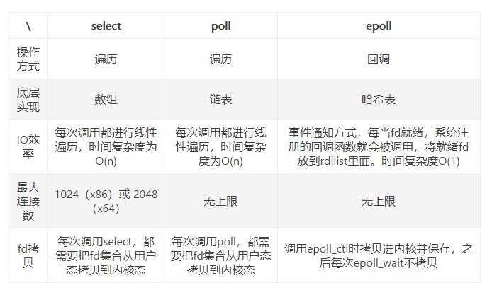
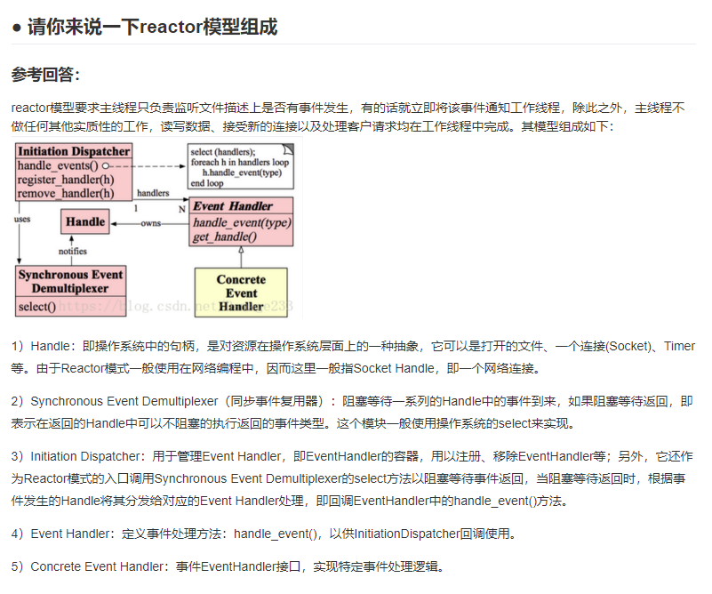

# C++面经汇总

## C++ const 放在指针变量前后有和区别？ 如

1、const int * a = & b;

2、int const * a = & b;

3、int * const a = & b;

4、const int * const a = & b;

const 放在类型前后没有区别，我们采用从右到左方法。

1和2等价，都表示常量的指向int的指针， 这就意味着无法通过修改*ptr 来改变值。但是该指针可以指向另一个变量。

3表示，表示常量的指针指向int，那么该指针无法指向另一个变量，但是可以修改它指向的变量的值。

4表示，该指针无法指向另一个变量，同时无法通过修改*ptr 来改变它指向变量的值

```cpp
void func1(){
    int b = 50, c = 60;
    int const* a = &b;
    a = &c;//正确，该指针可以指向另一个变量c
    printf("*a:%d\n", *a);
    (*a) = 30;//错误，无法通过*a 来改变b
    printf("*a:%d, c:%d\n", *a, c);
}

void func2(){
    int b = 50, c = 60;
    int* const a = &b;
    a = &c;//错误，该指针无法指向另一个变量
    printf("*a:%d\n", *a);
    (*a) = 30;//正确，可以修改它指向的变量的值
    printf("*a:%d, c:%d\n", *a, c);
}

void func3(){
    int b = 50, c = 60;
    const int* const a = &b;
    a = &c;//错误，该指针无法指向另一个变量
    printf("*a:%d\n", *a);
    (*a) = 30;//错误，无法通过*a 来改变它指向变量的值
    printf("*a:%d, c:%d\n", *a, c);
}
```

## C++ const 放在函数前后有和区别？ 如

1、const int func(){}

2、int func() const{}

3、int const func(){}

const放在类型前后含义相同，所以1,3是等价的。而2放在函数func()后面表示这是一个只读函数，指无法通过This指针来改变成员变量。


## Select、Poll、Epoll。




https://www.jianshu.com/p/722819425dbd

## 左值引用和右值引用

1. 左值引用， 使用 `T&`, 只能绑定**左值**
2. 右值引用， 使用 `T&&`， 只能绑定**右值**
3. 常量左值， 使用 `const T&`, 既可以绑定**左值**又可以绑定**右值**
4. 已命名的**右值引用**，编译器会认为是个**左值**

链接：https://www.jianshu.com/p/d19fc8447eaa


## C++内存管理




---

# 面试算法题

- n个整数 的无序数组，找到每个元素后面比它大的第一个元素，要求时间复杂度O(n).

采用单调栈。

```cpp
    vector<int> arr{2,1,3,4,4,5,0,9};
    vector<int> res(arr.size(), -1);
    stack<int> mono;
    for(int i = 0;i < arr.size(); ++i)
    {
        while(!mono.empty() && arr[i] > arr[mono.top()])
        {
            res[mono.top()] = arr[i];
            mono.pop();
        }
        mono.push(i);
    }
    for(int i = 0;i < res.size(); i++)
        printf("%d,", res[i]);
    printf("\n");
```

- 给出一棵二叉树，每个节点有一个编号和一个值，该值可能为负数，请你找出一个最优节点（除根节点外），使得该节点将树分为两颗树后，分成的两棵树各节点的和之间的差绝对值最大。请输出该节点的编号，如果有多个相同的差，输出编号最小的节点。格式要求：

  ```
  输入：
  第一行四个节点，编号0-3，范围1-10000
  第二行，节点0-3的权值
  第三行到第五行，表示二叉树各节点间的父子关系
  例子
  4
  4 9-7-8
  0 1
  0 3
  1 2
  输出：
  节点编号，比如上述例子为3
  ```

  后序遍历即可